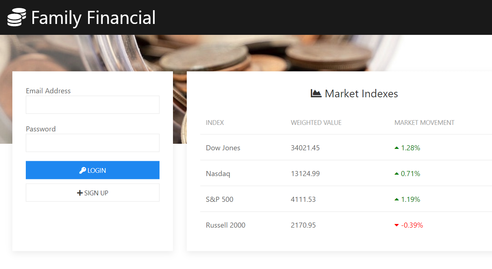
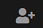
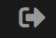

# Family Financials Application

## Description
A long term investment app built for families and for each of the families to pool their money together and to invest together.  This will help families realize the benefit of long term investment, especially for those of younger age.  

## User Story
As a user and a parent, I'd like to use an investment app that would allow me to add my family members, spouse and children (or grandparents), to an account where we are able to pool all of our money together to purchase stocks/ETFs/Mutual funds.

## Acceptance Criteria
- The application is deployed to a public cloud so anyone can get to it.
- As a new user to the application, the user is able to create a new user account.
- As a user logs in to the application, the password must not be visible and shall be hashed. 
- Once a user logs in, the application should give the user the ability to add any family members, to logout, and to buy stock(s).
- If the user's account already owns stock(s), as the user logs in, the dashboard should provide the user a pie-chart that shows all of the stocks in the account.
- The pie-chart on the dashboard should be color-coded and has labels and hover-over effect to give the user a snapshot of what's in the account and who owns what and how much.
-  The user should have the ability to choose what stock(s) he/she wants to purchase and how many shares and for which family member.
- The user should have the ability to sell the stock(s) for any listed family members of the account.
- When a user logs out, the user is taken to the home page where the user can login again.

## Product Landing Page

## GitHub Repository
Code repository location is at the following link:  
https://github.com/htang2021/famfin

## Application Deployment
Application is deployed to Heroku:  
https://familyfinancials.herokuapp.com/

## Usage Instruction
1. Go to the landing page at https://familyfinancials.herokuapp.com.
2. For new user, click on + SIGN UP to create an account.
3. Fill out all of user information on the pop-up form and create account.
4. As an account owner, family members can then be added by clicking on the  at the upper right hand corner of the page, then fill out the form and click + ADD MEMBER to add.
5. Once all members are added to the account, each member can purchase shares of stocks or funds by entering the ticker and quantity on the BUY STOCK side of the page.
6. After the account is funded with stock purchases, a pie-chart is drawn that illustrates each of the members' holding(s) and the updated total amount of each holding, which may be more or less than the initial investment (gain or loss).
7. The account user can sell the member's holding on his/her behalf, to the right of the page, SELL STOCK.
8. To sell a stock, select the member from the members list and also the stock ticker that is to be sold and quantity, then click on SELL STOCK.  Pie chart will update accordingly.
9. To logout, click on the  at the upper right hand corner to logout, and the user will be brought to the landing page.

## Contributors
[Graham Hall](https://ghall.dev/) |
[Clayton Goff](https://clayto30.github.io/professional-portfolio/) |
[Jennifer Nguyen](https://njthanhtrang.github.io/2.-Advanced-CSS-Challenge-Professional-Portfolio/#Contact) |
[Hung Tang](https://htang2021.github.io/htang-porfolio/)

## License & Credit
[UIkit](https://getuikit.com)  
[Font Awesome](https://fontawesome.com/)  
[Alpha Vantage](https://www.alphavantage.co/)  
[twelvedata](https://twelvedata.com/)  
[ChartJS](https://www.chartjs.org/)

End of README.  Last updated May 16, 2021